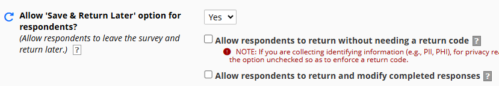

# SaveAndReturnRedirector
## Introduction
This external module is very simple. When enabled for a project,
it will redirect ALL Save & Return button clicks to a participant
portal or other URL of your choosing.

Use of the module with a survey, requires you to set the "Allow 'Save & Return Later'
option for respondents?" to Yes for that survey as shown below. 
Neither of the checkboxes in this section of survey settings, however, are required to be checked.

## Configuration
This EM has three properties:
<ul>
<li><b>Enabled</b> - Is the redirector enabled for this project?</li>
<li><b>Button text</b> for redirector button. If left empty, it defaults to 'Save & Return Later'</li>
<li><b>URL</b> to use for redirector button action</li>
</ul>

If the Enabled button is unchecked, despite the other settings, the module will be rendered inoperable.

## Acknowledgement
Thanks to <a href="https://github.com/123andy">Andy Martin</a>, who in the back of a session room during REDCap Vancouver in 2019, helped me create an earlier version of this external module.
